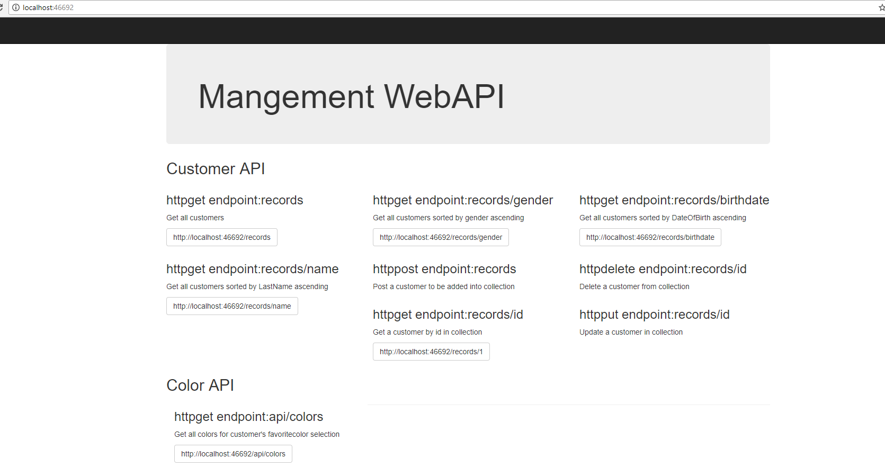

# Management Solution Repository
In this repo, I provide a solution to manage customers by using technologies of ASP.NET WebAPI (developed in Visual Studio 2015), Angular4 (developed in Visual Studio Code).

# Code Structure
Management.sln contains a console project,a Unit Test project, a ASP.NET WebAPI project and an Angular4 frontend porject.

### CustomerManagement.csproj is a console porject which contains classes CustomerManager,FileReader,ConsoleDisplayer,models.
CustomerManager is the class to manipulate customer collection. It has functionalities of CRUDs and sorting customers.

FileReader reads the customers from file into customer collection. It uses async ReadLineAsync method to read line by line from file. The purpose of using async is to make the IO operations aligned with computational operations responsively.

ConsoleDisplayer displays the customer collection in corresponding sorting criteria.

### CustomerManagementTests.csproj is a test project to test the CustomerManager and FileReader. 
CustomerManagementTests covers the add/sorting test cases and file reading functionality.

### CustomerManagementWebAPI.csproj is a ASP.NET WebAPI project.
CustomerManagementWebAPI provides the end points of GET/POST/PUT/DELETE customer(s) functionalities. 
Once this project is started in Visual Studio 2015, there is a introduction on the end points on home page(http://localhost:46692/) as shown below.

### CustomerManagementFrontend is an Angular4 CLI project.
CustomerManagementFrontend provides the front end of customer management. It has only one angular module app.module so far as this project is simple enough to be contained in one angular module. As this project grows, I should separate out more modules, components and routings based on functions,security concerns.

core folder contains the services which are singltons and injected into components.
customers folder contains the components of display/edit/add customer(s).
shared folder contains shared components like pipes,filter-textbox.

# how to run?
#1. Open Management.sln in Visual Studio 2015.
#2. Set CustomerManagementWebAPI project as Startup project and start it up by debugging it.
#3. Open folder CustomerManagementFrontend in Visual Studio Code.
#4. Open Integrated Terminal in menu View
#5. type in "ng server -o" to start up the angular frontend in browser.

# Pros
#1. Split up the Angular front end from ASP.NET WebAPI backend projects to separate concerns.
#2. Cross-Origin Resource Sharing (CORS) header Access-Control-Allow-Headers is added to response to allow Angular front end to access ASP.NET WebAPI backend by using a different origin.

# Cons
#1. Only one angular module app.module.
#2. No persistent storage of customer collection. For now, HttpContext.Current.Cache is used to store the customer collection.

